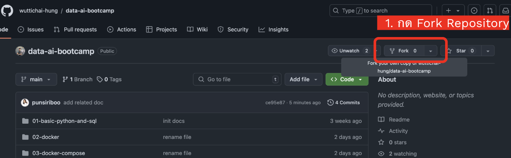
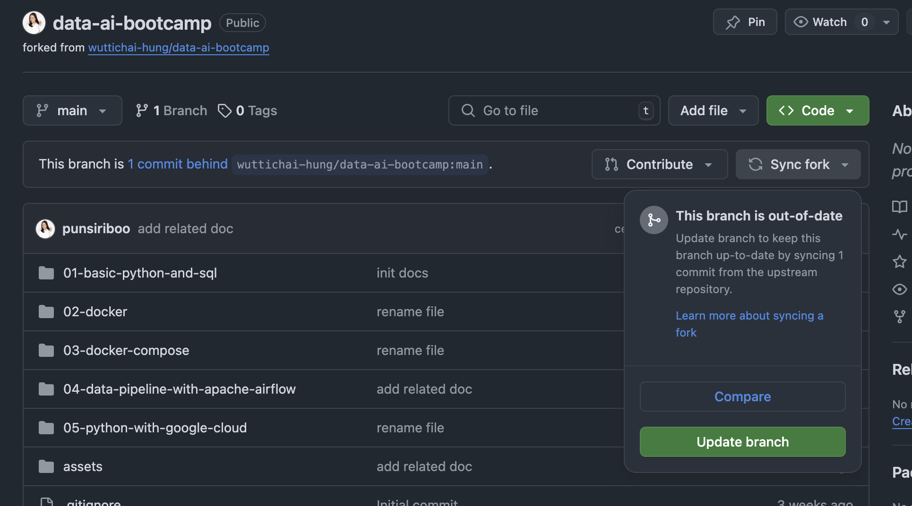
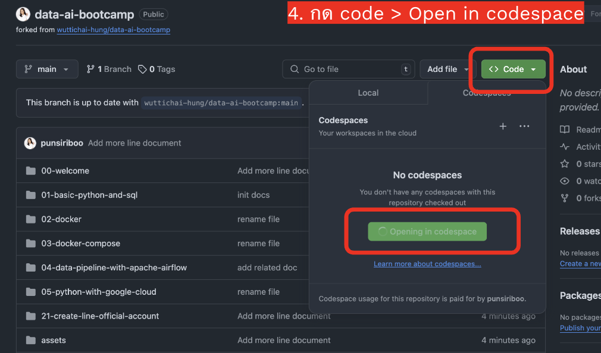
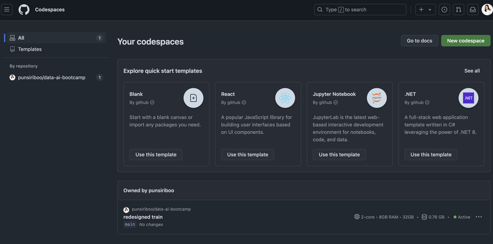
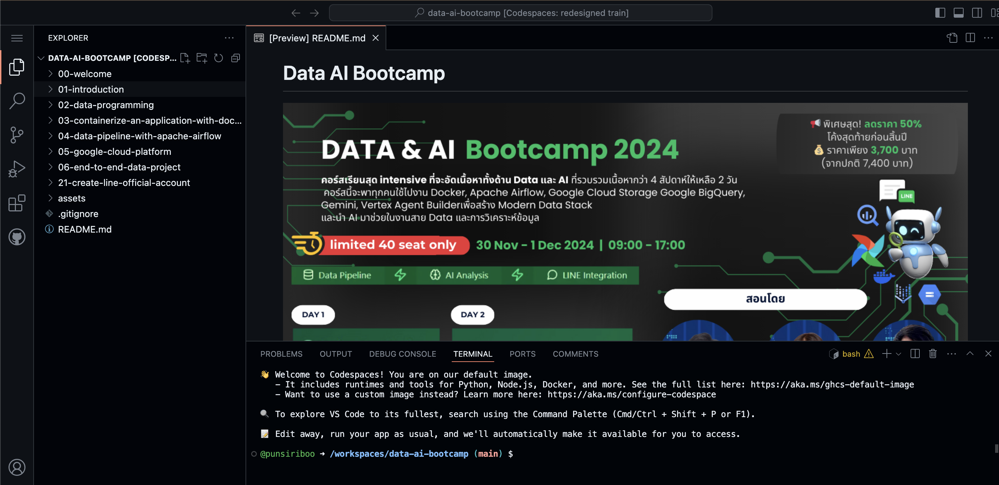
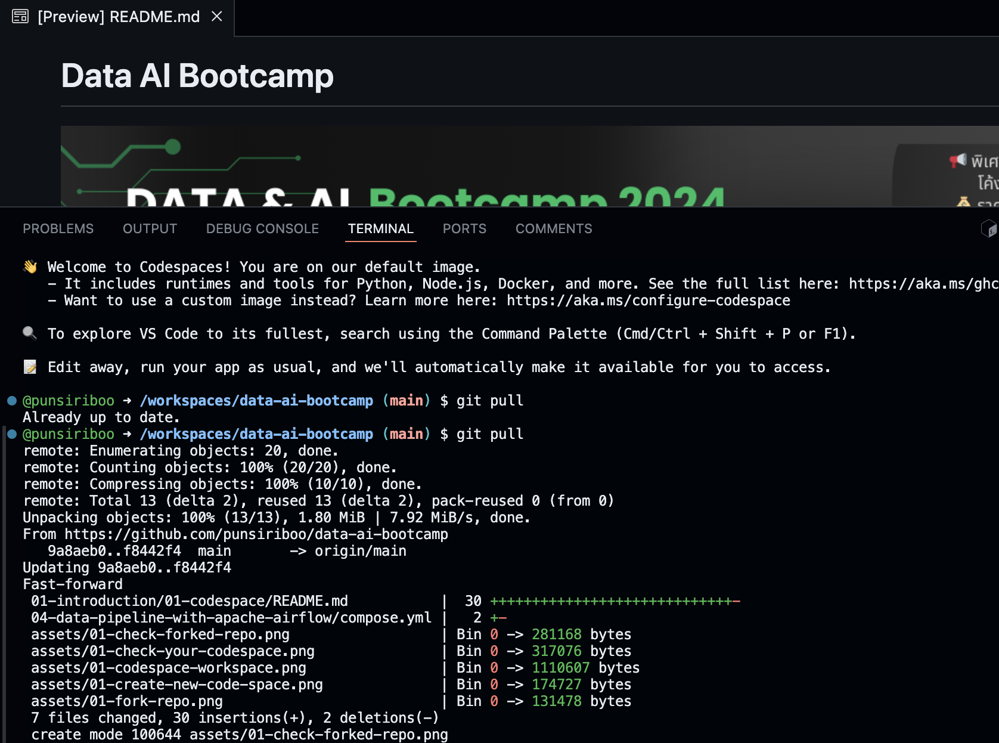

# การตั้งค่า GitHub Codespace

## ขั้นตอนการสร้าง Codespace แบบ Fork Repository
1. ให้กด Fork Repo โดย การ Fork คือการคัดลอก repository (repo) จากผู้สร้างต้นฉบับ (original repository) ไปยังบัญชีของคุณ
ไปที่ Repository ต้นฉบับ https://github.com/wuttichai-hung/data-ai-bootcamp
ปุ่ม Fork จะอยู่มุมบนขวาของหน้า repository เมื่อกดแล้ว ระบบจะคัดลอก repository ไปยังบัญชีของคุณโดยอัตโนมัติ
 

2. ให้เข้าไปดู repository ที่ fork มาได้ในบัญชีของคุณ เช่น https://github.com/YOUR-USERNAME/data-ai-bootcamp

 
- จากรูปจะเห็นว่า `data-ai-bootcamp` อยู่ใน Repo ของเรา
- ปุ่ม Sync Fork ใช้เพื่อ check ว่า code ของเราที่ดึงมาเป็น version ล่าสุดที่ตรงกับทีมสอน

3. ปุ่ม กด <> Code จะอยู่มุมบนขวาของหน้า repository
ให้กด แลือกแท็บ Code Space และ กด + เพื่อสร้าง Codespace ได้เลย
 
หากกด +  New codespace จะเป็นการสร้างพื้นที่ให้เรารันโค้ดได้โดยมีค่า default ดังนี้ 
- Branch: main
- Region: Southeast Asia
- Machine type: 2-core

4. เราสามารถตรวจสอบ Codespace ทั้งหมดที่เรามีได้โดยเข้าไปยัง https://github.com/codespaces
 

5. เพียงเท่านี้เราก็จะได้พื้นที่ในการเขียนและรัน code บนหน้าเว็บไซต์แล้ว
 

6. หาก code ของทีมสอนมีการ update เราสามารถ กด sync Fork ได้
และหลังจากนั้นให้ รันคำสั้ง `git pull` เพียงเท่านี้ เราจะได้ code version ใหม่ล่าสุด
 

## ขั้นตอนการสร้าง Codespace แบบ New Codespace
1. เข้าไปที่: https://github.com/features/codespaces
2. คลิกที่ปุ่ม "Get started"
3. เลือก "New codespace"
4. กำหนดค่าต่างๆ ดังนี้:
   - Select a repository: `wuttichai-hung/data-ai-boostcamp`
   - Branch: main
   - Region: Southeast Asia
   - Machine type: 2-core
5. คลิกปุ่ม "Create codespace"

## คำอธิบายเพิ่มเติม
- GitHub Codespace คือสภาพแวดล้อมการพัฒนาบนคลาวด์ที่ช่วยให้คุณสามารถเขียนโค้ดได้โดยตรงบนเว็บเบราว์เซอร์
- การเลือก Region ในภูมิภาคใกล้ตัวจะช่วยให้การเชื่อมต่อเร็วขึ้น
- Machine type 2-core เหมาะสำหรับการพัฒนาทั่วไป และมีค่าใช้จ่ายที่เหมาะสม

## ข้อควรระวัง
- Codespace จะมีเวลาใช้งานจำกัดต่อเดือนสำหรับบัญชีฟรี
- ควรปิด Codespace เมื่อไม่ได้ใช้งานเพื่อประหยัดเวลาการใช้งาน