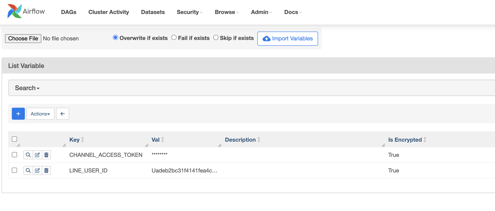
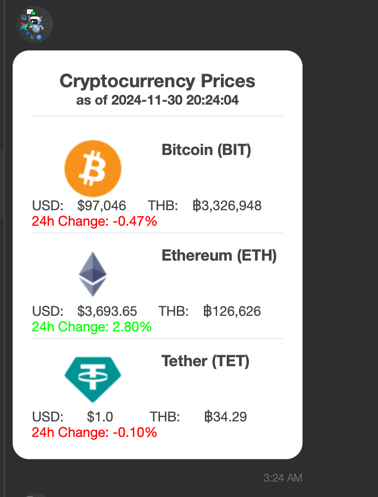
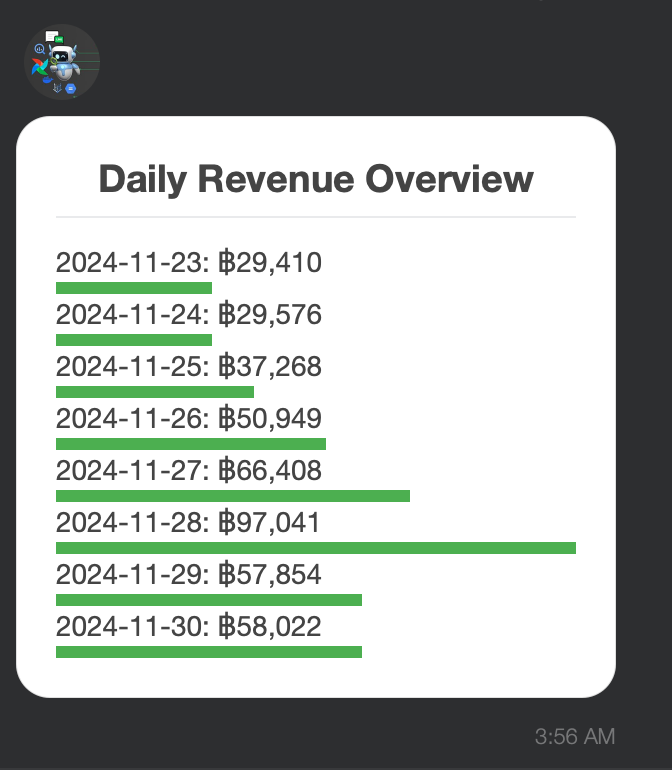

# Airflow with LINE Notify Task

## 1. คัดลอกไฟล์ DAG ไปยังโฟลเดอร์ `dags/`
ใช้คำสั่งด้านล่างเพื่อคัดลอกไฟล์นี้ไปยังโฟลเดอร์ที่ Airflow ใช้สำหรับจัดการ DAG:

```bash
cp 21_coingecko_api_with_line_notify.py 04-data-pipeline-with-apache-airflow/dags/
cp 22_bigquery_data_notify_dag.py 04-data-pipeline-with-apache-airflow/dags/

```

---

## 2. สร้าง Airflow Variables ที่จำเป็น

Airflow DAG นี้ต้องใช้ **Variables** สำหรับการตั้งค่า LINE API:

### วิธีเพิ่ม Variables ผ่าน Airflow UI

1. เข้า Airflow UI
2. ไปที่ **Admin > Variables**
3. เพิ่มค่า Variables ตามตารางด้านล่าง:

| Key                  | Value                                   |
|----------------------|-----------------------------------------|
| `CHANNEL_ACCESS_TOKEN` | ใส่ LINE Channel Access Token ของคุณ       |
| `LINE_USER_ID`       | ใส่ LINE User ID ที่ต้องการส่งข้อความถึง |



### หรือเพิ่ม Variables ผ่านคำสั่ง CLI

ใช้คำสั่งนี้ใน CLI เพื่อเพิ่มค่า Variables:

```bash
airflow variables set CHANNEL_ACCESS_TOKEN <YOUR_CHANNEL_ACCESS_TOKEN>
airflow variables set LINE_USER_ID <YOUR_LINE_USER_ID>
```

---

## 3. ทดสอบการทำงานของ DAG

1. เปิดใช้งาน DAG ผ่าน Airflow UI
2. กดปุ่ม "Trigger DAG" เพื่อเริ่มการทำงานของ DAG

## 4. ผลการรัน

 

