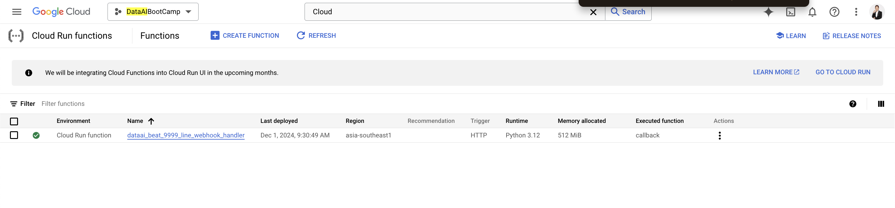
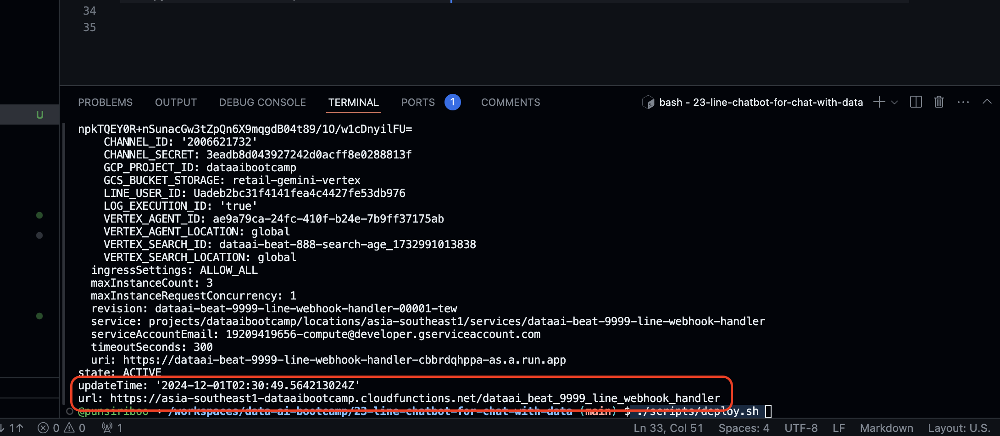
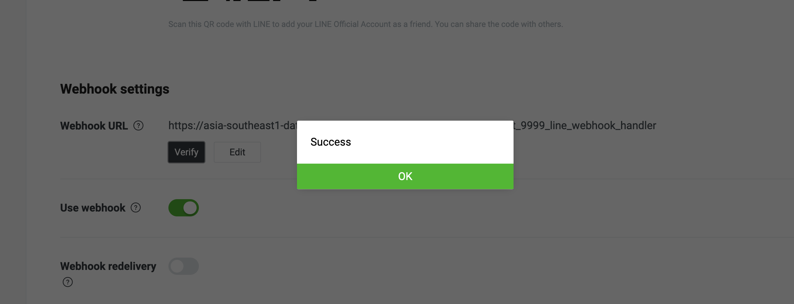

# Deploy LINE Chatbot to Cloud Function

1. Change to Folder `23-line-chatbot-for-chat-with-data`
```
cd 23-line-chatbot-for-chat-with-data
```


2. Copy and Edit `line_secret.yml.example`

```
cp line_secret.yml.example line_secret.yml
```

3. Upload file `sa.json` to folder `private`

4. Edit `scripts/init.sh` for deploy

```
cp scripts/init.sh.example scripts/init.sh
```

5.  Deploy you Cloud Run Function 

```
 ./scripts/deploy.sh 
```

6. Check Cloud Function Deploy at https://console.cloud.google.com/functions/list?referrer=search&project=dataaibootcamp



7. Copy Cloud Function Endpoint to use as web hook
 

8. Add and verify webhook



