# Vertex AI Agent Builder - Conversation Agent 
## Create Conversation Agent
1. **ขั้นตอนที่ 1: สร้าง Agent ใหม่**  เริ่มต้นด้วยการคลิกสร้าง Agent ใหม่ใน Vertex AI Agent Builder.
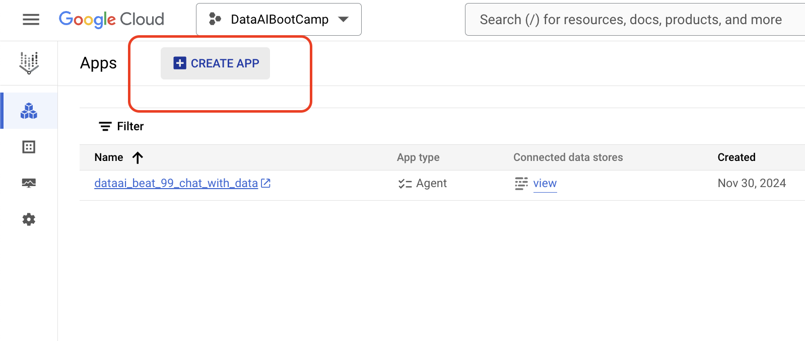  

2. **ขั้นตอนที่ 2: เลือกสร้าง Agent เอง**  เลือก "Build your own" เพื่อกำหนด Agent เองตามความต้องการ.
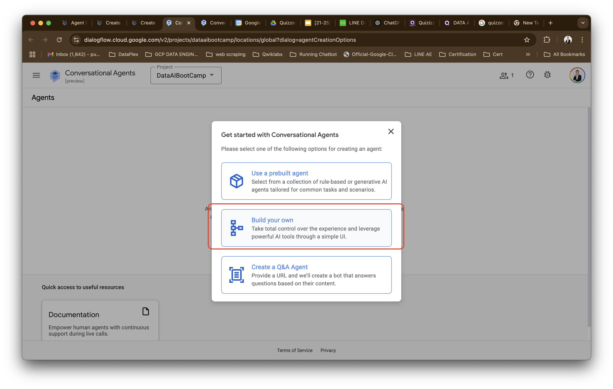  

3. **ขั้นตอนที่ 3: ตั้งชื่อ Agent**  
- ตั้งชื่อ Agent ของคุณ  เช่น "dataai_YOUR_NAME_chatwith_data" 
- และเลือก Region = `Global`
- เลือก Default language = `Thai`
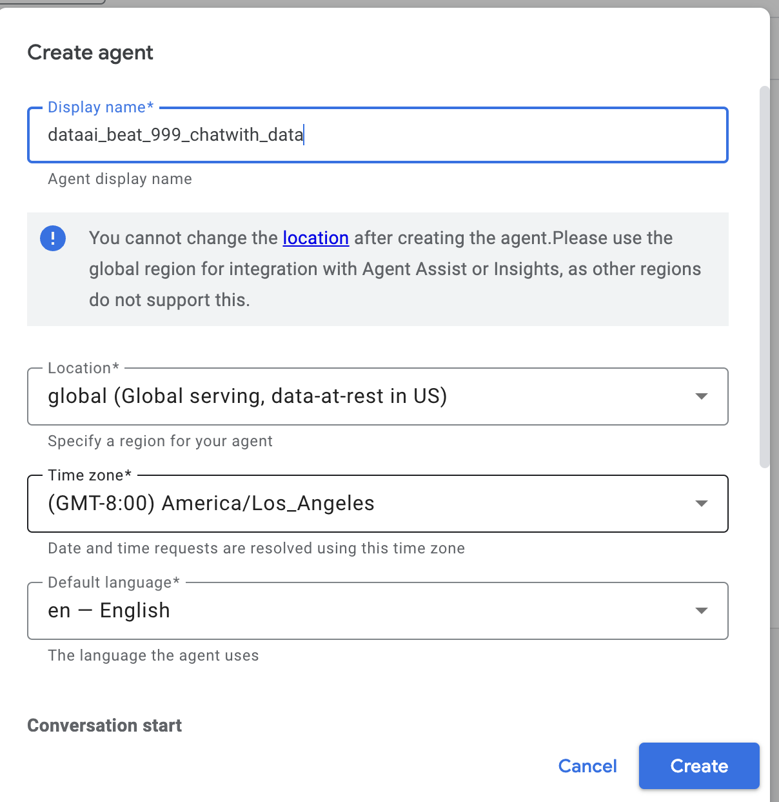  

4. **ขั้นตอนที่ 4: เลือก Generative AI Playbook** เลือกประเภท "Generative AI Playbook" เพื่อใช้ประโยชน์จากความสามารถของ Generative AI.  ในขั้นตอนนี้ คุณสามารถเลือก Template ที่เหมาะสมกับ use case ของคุณได้  หรือจะเริ่มต้นแบบเปล่าก็ได้.
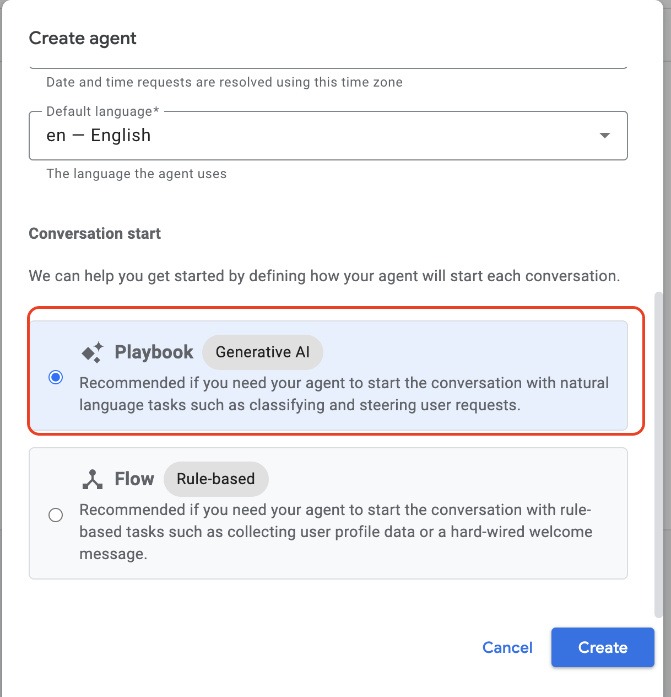  


## Create Data Store
5.  **ขั้นตอนที่ 5: สร้าง Data Store**  ในส่วนนี้ เราจะสร้าง Data Store เพื่อเชื่อมต่อกับแหล่งข้อมูลที่ Agent จะใช้ในการตอบคำถาม. คลิก "Create a data store".
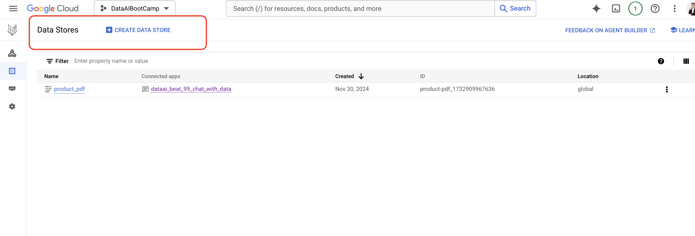

6. **ขั้นตอนที่ 6: เลือกแหล่งข้อมูล** เลือกแหล่งข้อมูลสำหรับ Data Store. ในที่นี้เลือก "Cloud Storage"  เพราะเราจะใช้ข้อมูลจาก Cloud Storage.
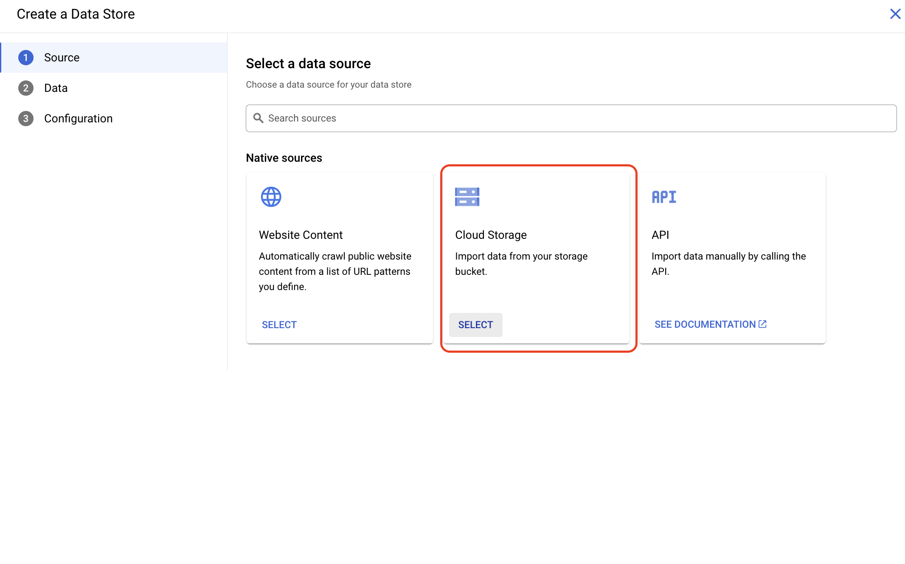 

7.**ขั้นตอนที่ 7: เลือกไฟล์หรือโฟลเดอร์** เลือกไฟล์หรือโฟลเดอร์ใน Cloud Storage ที่คุณต้องการใช้เป็นแหล่งข้อมูลสำหรับ Agent.
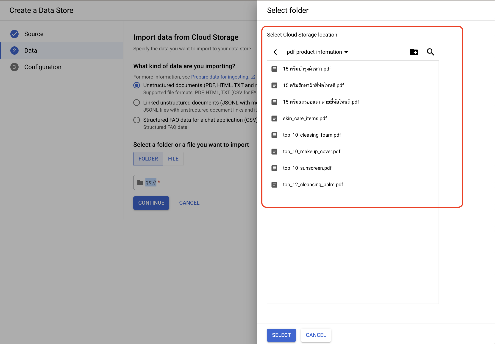 

8. **ขั้นตอนที่ 8: ตั้งชื่อ Data Store**  ตั้งชื่อ Data Store ของคุณ เช่น "beauty_products_datastore"  เพื่อให้ง่ายต่อการจัดการและจดจำ.  และกด "Create".
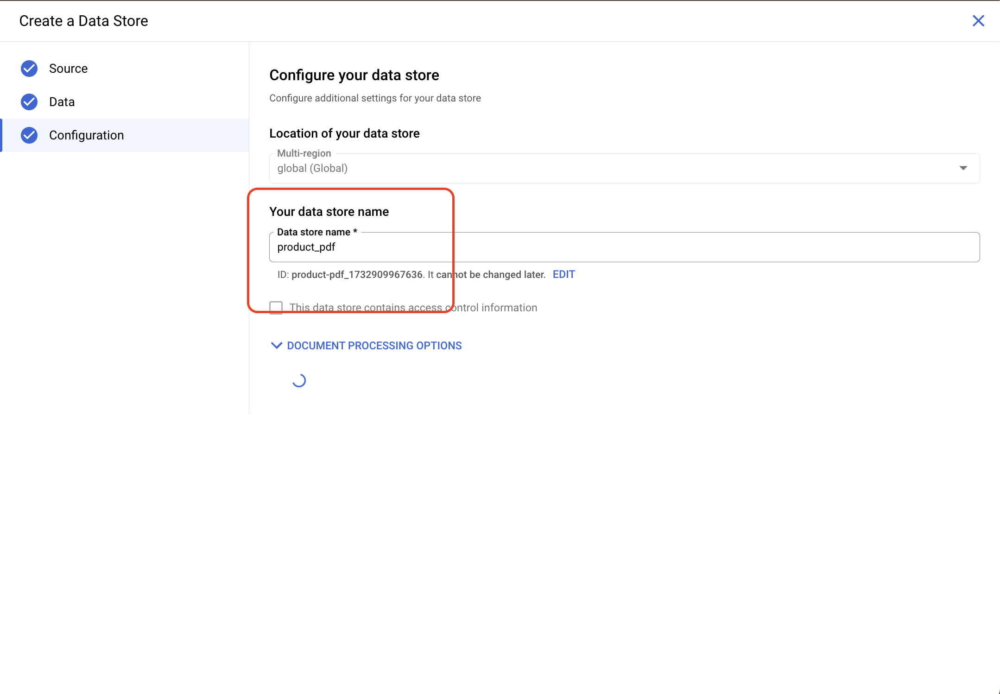 


### ต้องสร้างทั้งหมด 3 Data store
1. product_pdfs : gs://vertex_ai_search_data_9999/pdf-product-infomation
2. campaing_pdf: gs://vertex_ai_search_data_9999/สินค้าแลกแต้มรับลมหนาว.pdf
3. member_register_pdf: gs://vertex_ai_search_data_9999/บัตรสมาชิกรูปแบบใหม่.pdf

## Create Tools
9.  **ขั้นตอนที่ 9: สร้าง Tools**  หลังจากสร้าง Data Store แล้ว  เราจะสร้าง Tools เพื่อกำหนดวิธีการที่ Agent จะใช้ Data Store ในการตอบคำถาม. คลิก "Create a tool"

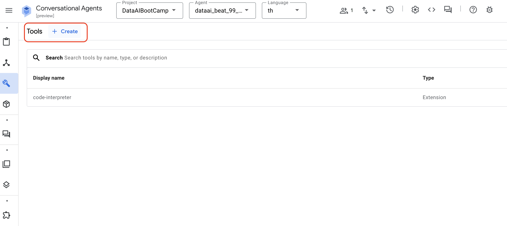


10. **ขั้นตอนที่ 10: กำหนดค่า Tool**  
- ตั้งชื่อ Tool เช่น "products", "member_register", "promotion_campaign"  
- ใส่คำอธิบายสั้นๆ  เพื่อระบุหน้าที่ของ Tool นั้นๆ  
- เลือก Data Store ที่เกี่ยวข้องกับ Tool นั้นๆ  เช่น  "product_pdfs", "member_register_pdf", "campaing_pdf" ตามลำดับ.

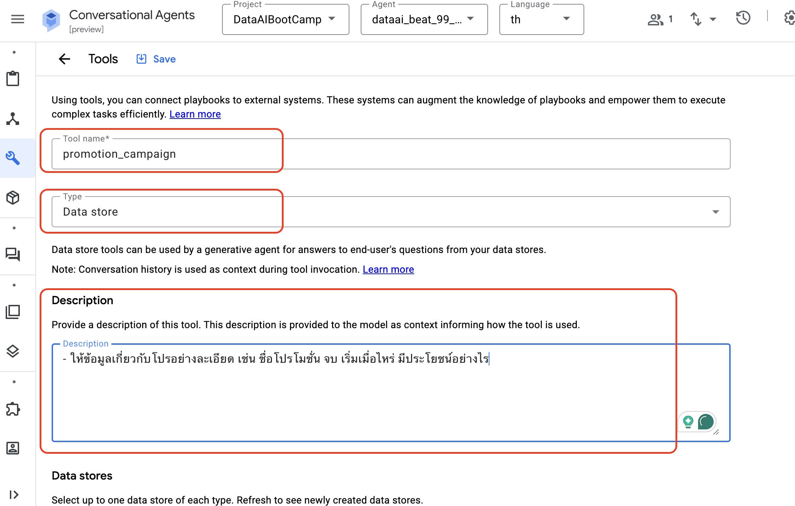 

11. **ขั้นตอนที่ 11: เลือก Model และ Prompt**
- เลือก Model  เช่น  "gemini-1.0-pro-001"  เพื่อใช้ในการประมวลผลข้อมูลจาก Data Store.
- เพิ่ม Custom Prompt  เพื่อให้ Agent เข้าใจวิธีการใช้ Tool และ Data Store อย่างถูกต้อง.  Prompt ควรกำหนดคำถามที่ชัดเจนและตรงประเด็น เพื่อให้ Agent สามารถดึงข้อมูลที่เกี่ยวข้องมาตอบได้อย่างแม่นยำ.

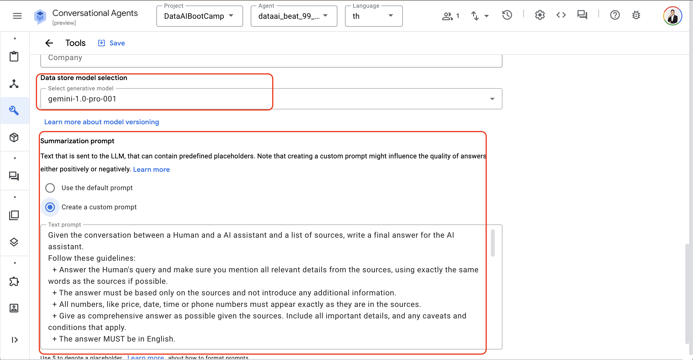

12. **ขั้นตอนที่ 12: บันทึก Tool**  คลิก "Save" เพื่อบันทึกการตั้งค่า Tool.  ทำซ้ำขั้นตอนที่ 9-12  เพื่อสร้าง Tools เพิ่มเติมตามที่ต้องการ.  ในตัวอย่างนี้  

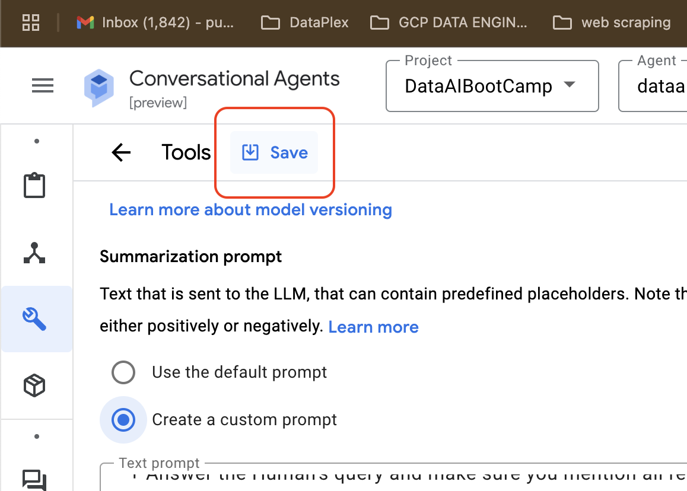 

### Tool Creations Information
ต้องสร้างทั้งหมด 3 Tools คือ "products", "member_register" และ "promotion_campaign".
1. products
```
ข้อมูลเกี่ยวกับสินค้าความงาม เช่นครีมกันแดด รองพื้น โฟมล้างหน้า ครีมทาผิวขาว ครีมทาฝ้า
ให้ข้อมูลรายละเอียดสินค้า อย่างละเอียดเช่น 
- ชื่อสินค้า 
- ราคา 
- ส่วนผสม อย่างละเอียด
- แนะนำวิธีการใช้ ประโยชน์
```

2. member_register
```
การสมัครสามาชิก ซีเจ สบาย
การ์ด ว่ามีขั้นตอนอะไรบ้าง ต้องเตรียมเอกสารอะไรบ้าง
```

3. promotion_campaign
```
- ให้ข้อมูลเกี่ยวกับโปรอย่างละเอียด เช่น ชื่อโปรโมชั่น จบ เริ่มเมื่อไหร่ มีประโยชน์อย่างไร
```

## Defin Playbook
**กำหนด Playbook** Playbook คือชุดคำสั่งและเงื่อนไขที่ควบคุมการทำงานของ Agent.  ในส่วนนี้ คุณจะต้องกำหนด Goal, Instructions และตัวอย่างคำถามสำหรับการทดสอบ.

```
## Goal
- ให้ข้อมูลสินค้าที่ถูกต้องและครบถ้วน
- สามารถให้คำตอบเกี่ยวกับการสมัครสมาชิกได้
- สามารถบอกโปรโมชั่น การสะสมแต้ม เพื่อแลกของรางวัลได้

## Instructions 
- เมื่อถามเกี่ยวกับ สินค้า ให้ใช้ ${TOOL:products}
- ${TOOL:member_register} ตอบเกี่ยวขั้นตอนสมาชิก
- ตอบคำถามเกี่ยวกับรายละเอียดสินค้า เช่น ชื่อสินค้า ราคา ข้อมูลจำเพาะ คุณสมบัติพิเศษ  และแบรนด์
- ช่วยผู้ใช้ค้นหาสินค้าที่ตรงกับความต้องการและให้คำแนะนำเกี่ยวกับสินค้าในหมวดหมู่หรือประเภทที่เกี่ยวข้อง
- ${TOOL:promotion_campaign} ตอบเกี่ยวกับส่วนลด โปร สินค้า
- ตอบคำถามเป็นภาษาไทยเท่านั้น
```

## Test Chat 
ตัวอย่างคำถามสำหรับทดสอบ: ใช้คำถามเหล่านี้เพื่อทดสอบการทำงานของ Agent และปรับแต่ง Playbook ให้เหมาะสม

- โฟมล้างหน้าที่ดีเป็นไง
- โฟมล้างหน้าที่ดี ต้องมีส่วนผสมอะไรบ้าง
- ขอรายละเอียด โฟมล้างหน้าCetaphil
- แนะนำกันแดดที่ SFP สูงๆหน่อย
- แนะนำกันแดดที่ไม่มัน
- สมัครสมาชิกยังไง
- ช่วงนี้มีโปรไรบ้าง

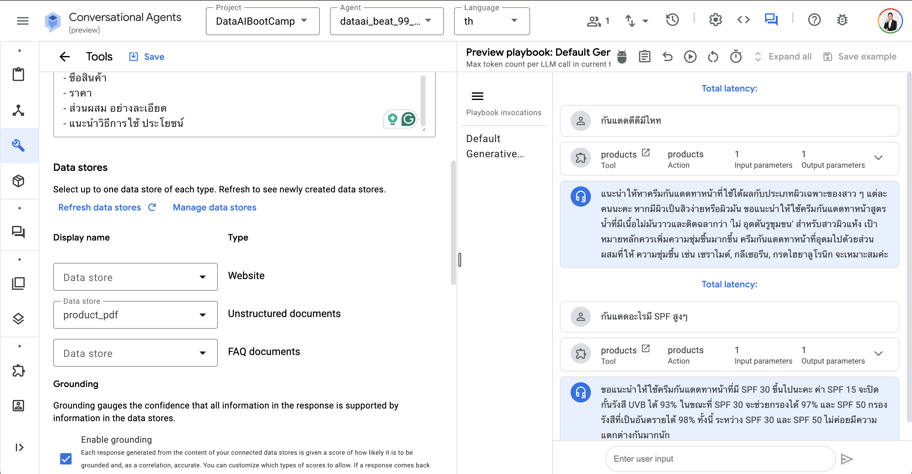
