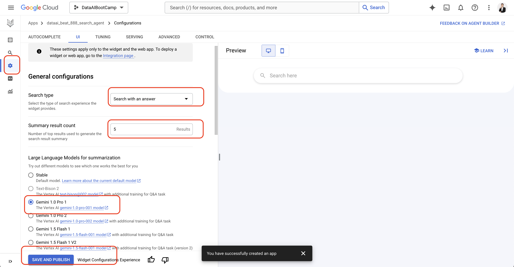

# Create Vertex AI Search Agent

1. **ขั้นตอนที่ 1: สร้าง Agent ใหม่**  
เริ่มต้นด้วยการคลิกสร้าง Agent ใหม่ใน Vertex AI Agent Builder.
ไปที่หน้า https://console.cloud.google.com/gen-app-builder/engines?project=dataaibootcamp


2. **ขั้นตอนที่ 2: ตั้งชื่อ Agent**  
- name : dataai_yourname_yyy_search_agent
- company: dataai_yourname_yyy_search_agent


3.  **ขั้นตอนที่ 3: สร้าง Datastore** หลังจากสร้าง Agent แล้ว ให้คลิก "Create a datastore" เพื่อสร้าง Datastore สำหรับเก็บข้อมูลที่จะใช้ในการค้นหา.


4. **ขั้นตอนที่ 4: เลือก Cloud Storage เป็น Datastore** 
- เลือก "Google Cloud Storage" เป็นแหล่งข้อมูลสำหรับ Datastore  
- เนื่องจากเราจะใช้ข้อมูลจาก Cloud Storage.  จากนั้นเลือก bucket และไฟล์หรือโฟลเดอร์ที่ต้องการใช้.


 

5.  **ขั้นตอนที่ 5: เลือกไฟล์ ndjson ของข้อมูลสินค้า** 
 ในขั้นตอนนี้  ให้เลือกไฟล์ `product_search_dataai.ndjson`  ซึ่งเป็นไฟล์ข้อมูลสินค้าในรูปแบบ ndjson (newline delimited JSON) ที่อยู่ใน Cloud Storage bucket `vertex_ai_search_data_9999/product_retails`.  รูปแบบ Structured data (JSONL) จะถูกเลือกโดยอัตโนมัติเนื่องจากไฟล์เป็น ndjson.  ระบบจะทำการตรวจจับ schema ของข้อมูลเอง.

- gs://vertex_ai_search_data_9999/product_retails/product_search_dataai.ndjson


6. **ขั้นตอนที่ 6: ตรวจสอบ Schema และดำเนินการต่อ**  
หลังจากเลือกไฟล์ ndjson แล้ว Vertex AI Search จะทำการตรวจสอบและแสดง schema ของข้อมูลที่อยู่ในไฟล์.  ตรวจสอบความถูกต้องของ schema  เช่น ชนิดข้อมูลของแต่ละคอลัมน์  และคลิก "Continue" เพื่อดำเนินการสร้าง Datastore ต่อ.  ในขั้นตอนนี้ คุณสามารถกำหนด Key Properties ซึ่งเป็นคอลัมน์สำคัญที่ใช้ในการระบุเอกสารแต่ละรายการใน Datastore ได้.  เช่น sku, image_path
 

7.**ขั้นตอนที่ 7: ตั้งชื่อ Datastore**  
ตั้งชื่อ Datastore ของคุณ เช่น `dataai_yourname_yyyy_retail_products_datastore` โดยแทนที่ `yourname` ด้วยชื่อของคุณและ `yyyy` ด้วยปีปัจจุบัน  และคลิก "Create" เพื่อสร้าง Datastore. 
- dataai_yourname_yyyy_retail_products_datastore
 


8. **ขั้นตอนที่ 8: สร้าง Search Agent พร้อม Datastore** 
หลังจากสร้าง Datastore เสร็จสิ้นแล้ว ให้กลับไปที่หน้าสร้าง Agent และเลือก Datastore ที่เพิ่งสร้างขึ้นมา  เช่น  `dataai_yourname_yyyy_retail_products_datastore`  เพื่อเชื่อมต่อกับ Search Agent.  จากนั้นคลิก "Create" เพื่อสร้าง Search Agent.

 

9. **ขั้นตอนที่ 9: ตรวจสอบ Datastore** 
หลังจากสร้าง Search Agent เสร็จสิ้นแล้ว คุณสามารถตรวจสอบ Datastore ที่เชื่อมต่อกับ Agent ได้.  ในภาพนี้แสดงให้เห็นว่า Datastore  ถูกสร้างขึ้นเรียบร้อยแล้วและพร้อมใช้งาน.

 


10.  **ขั้นตอนที่ 10: กำหนดค่า Search Agent และทดสอบ**  
หลังจากสร้าง Search Agent และ Datastore เรียบร้อยแล้ว  คุณสามารถกำหนดค่าเพิ่มเติม  เช่น เลือก Model ภาษา  และทดสอบการค้นหาด้วยคำถามต่างๆ  ในภาพนี้แสดงการตั้งค่า Search Agent ให้ใช้ Gemini as a LLM
- Search type: Search with answer
- Gemini 1.0 Pro 1



11. **ขั้นตอนที่ 11: กำหนดค่าการแสดงผลข้อมูล**  
ในส่วนนี้ คุณสามารถกำหนดค่าการแสดงผลข้อมูลเพิ่มเติมได้ เช่น การแสดงรูปภาพ  การแสดงผลลัพธ์การค้นหา  และการจัดรูปแบบข้อความ.  ในภาพนี้แสดงการตั้งค่าให้แสดงรูปภาพและข้อมูลสินค้า.  เลือก Data display options 

 

12.**ขั้นตอนที่ 12: ดูการ Integrate** 
ลังจากตั้งค่า Search Agent เสร็จสิ้น  คุณสามารถดูการ Integrate และทดสอบการทำงานของ Agent ได้.  ทั้ง Web/API/Client Lib
 


# Vertex AI Search in Python 

1. เปลี่ยนไปยังโฟลเดอร์โปรเจกต์
ใช้คำสั่ง cd เพื่อเปลี่ยนไปยังโฟลเดอร์ชื่อ 25-vertex-ai-search
```
cd 25-vertex-ai-search
```

2. คัดลอกไฟล์ตัวอย่างการตั้งค่า
คำสั่ง cp ใช้เพื่อคัดลอกไฟล์ vertex_ai_secret.yml.example และเปลี่ยนชื่อเป็น vertex_ai_secret.yml เพื่อใช้เป็นไฟล์ตั้งค่าหลัก

```
cp vertex_ai_secret.yml.example vertex_ai_secret.yml
```

3. ติดตั้ง Dependencies ของโปรเจกต์
ใช้คำสั่ง pip เพื่อติดตั้งไลบรารีทั้งหมดที่ระบุไว้ในไฟล์ requirements.txt

```
pip install -r requirements.txt
```

4. copy sa.json มาวางที่ Folder นี้ 

5. ใช้คำสั่ง python เพื่อรันไฟล์ vertex_agent_search.py ซึ่งเป็นสคริปต์หลักของโปรเจกต์
```
python vertex_agent_search.py
```
